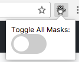

⚠ This is currently not available in the Chrome Web Store because of a trademark infringement on the name. It has been updated with a name change (az-mask) to comply but has been in a status of "Pending Review" since April 2019. If you know of a way to get this resolved please hit me up ⚠

# Azure Mask
This is a browser extension that will mask GUIDs (such as Subscription IDs), email addresses, keys, and connection strings with a blur. The intention of the extension is to make it easier to do screen recordings without revealing sensitive, personal, account information that may show up on screen. It will only run and apply against Azure portal URLs. It's available in Chrome and Firefox.

## Features

* Blurs GUIDs (such as Subscription IDs)
* Blurs your account email
* Hides the "Report a Bug" button (if found)
* Toggle the mask on/off and store this state
* Apply the mask (if enabled) after Document Object Model (DOM) mutations

## Install the Extension

### Chrome

#### From Chrome Web Store

1. In Chrome go to [Chrome Web Store](https://chrome.google.com/webstore/search/azure%20mask)
2. Click on Azure Mask extension
3. Click on Add To Chrome
4. Confirm any prompts

#### From Package

1. Go to [Releases](https://github.com/clarkio/azure-mask/releases) and download the latest `.crx` file (e.g. `az-mask-1.1.5.crx
`)
2. In Chrome go to [chrome://extensions](chrome://extensions)
3. Check the "Developer mode" option in the top-right corner
4. Find the location where you downloaded the `.crx` file 
5. Drag the `.crx` file to your Chrome window that has the extensions view open
6. Confirm any prompts

#### From Source

1. `git clone git@github.com:clarkio/azure-mask.git`
2. In Chrome go to [chrome://extensions](chrome://extensions)
3. Check the "Developer mode" option in the top-right corner
4. Click the "Load unpacked extension" button
5. Navigate to where you cloned this repo and then choose `/azure-mask/src`

After following these steps you should now see the new extension icon in Chrome.

### Firefox

1. In Firefox go to [azure-mask add-on](https://addons.mozilla.org/en-US/firefox/addon/azure-mask/)
2. Click "Add to Firefox"
3. You'll see a pop up notification in the address bar from Firefox. Click "Add"
4. You'll see a confirmation that it was added. Click "Ok"
